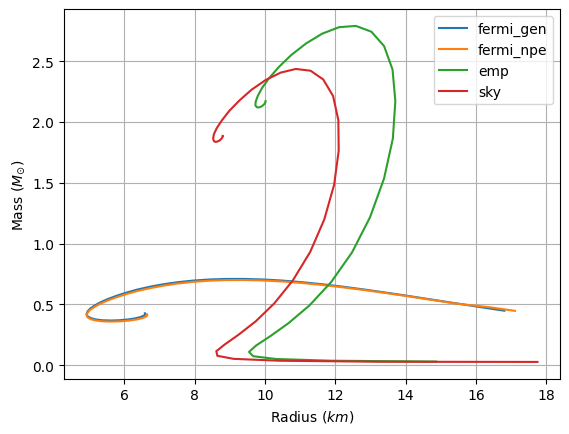
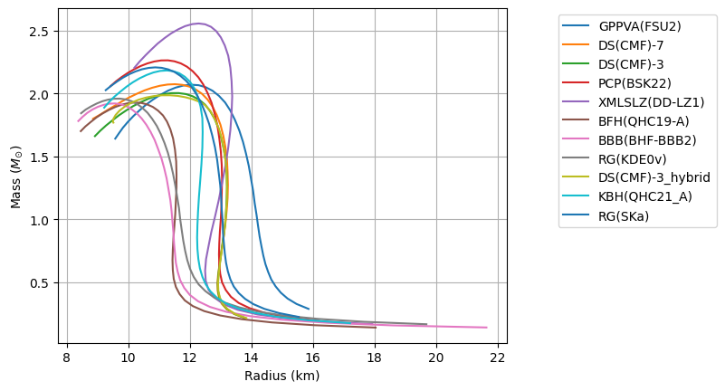

In this repository, you will find a project in numerical physics in python. The goal of this project is to model and study neutron stars, astrophysical objects which are remnants of supernovae. They are the smallest and densest astrophysical objects in the universe, after black holes.

The system of ordinary differential equations that describe such objects is composed by a mass equation
```math
 \frac{dm}{dr} = \frac{4 \pi r^2 \epsilon(r)}{r} ~,
```
and a pressure equation
```math
\quad \frac{d p}{dr} = \frac{G \epsilon(r) m(r)}{c^2 r^2} ~, \qquad \frac{d p}{dr} = \frac{G \epsilon(r) m(r)}{c^2 r^2} \Big ( 1 + \frac{p(r)}{\epsilon(r)} \Big ) \Big ( 1 + \frac{4 \pi r^3 p(r)}{m(r)c^2} \Big ) \Big ( 1 - \frac{2 G m(r)}{c^2 r} \Big) ~,
```
where the first one is calculated in Newtonian regime and the second one using general relativity. The boundary conditions are
```math
p(r = R_{object})= 0 ~, \quad p(r = 0) = p_0 ~, \quad m(r = 0) = 0 ~.
```

However, this system is incomplete, because in order to be solvable, it needs a relation between energy density $\epsilon$ and pressure $p$, called an equation of state, which depends on the particle content (and the physics underneath).

Integrating this system results in calculating physical quantities (like mass, radius, gravitational redshift or moment of inertia) given an equation of state and a central pressure $p_0$ of the neutron star.

The code to solve this system can be found in 
[solver.py](https://github.com/PhysicsZandi/NeutronStars/blob/main/src/solver.py).

For what concerns the equation of state, we have considered 2 kinds of equations of state:
1. Degenerate ideal Fermi gas of neutrons, with the addition of protons and electrons or interactions (empirical or Skyrme ones). The code to generate such equations of state can be found in [fermi_eos.py](https://github.com/PhysicsZandi/NeutronStars/blob/main/src/fermi_eos.py) and examples with plots in [fermi_eos_examples.ipynb](https://github.com/PhysicsZandi/NeutronStars/blob/main/src/fermi_eos_examples.ipynb), with a brief review of the physics needed to calculate them. The following picture is the mass versus radius plot for 4 different Fermi gas equations of state.



2. Realistic equations of state in the archive [CompOSE](https://compose.obspm.fr). The code to study such equations of state can be found in [compose.py](https://github.com/PhysicsZandi/NeutronStars/blob/main/src/compose.py) and examples with plots in [compose_examples.ipynb](https://github.com/PhysicsZandi/NeutronStars/blob/main/src/compose_examples.ipynb), with a brief review the references to find the related articles. The following picture is the mass versus radius plot for 11 different realistic equations of state.
 



The documentation of the project, and the presentation as well, are in [documentation](https://github.com/PhysicsZandi/NeutronStars/tree/main/src/documentation).